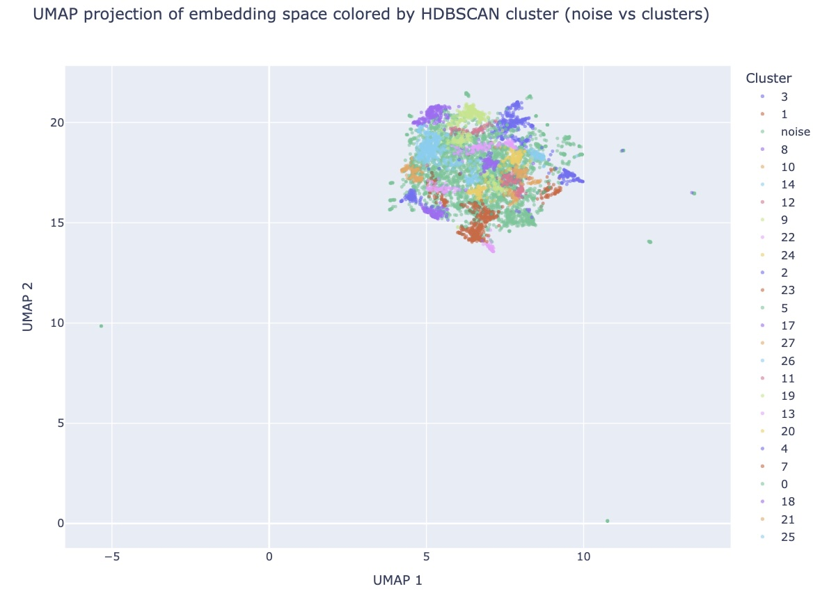
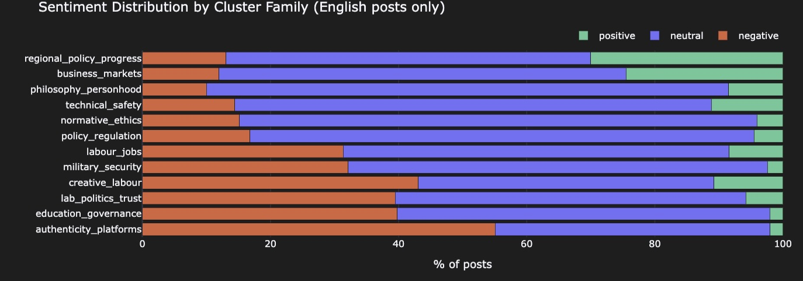
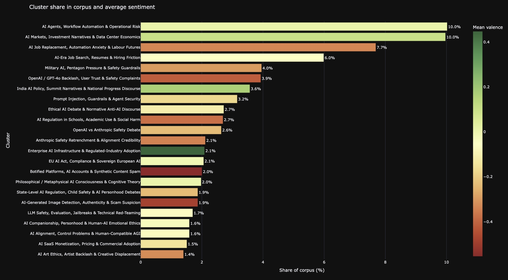

# reddit-ai-safety-discourse-2026
Unsupervised clustering + sentiment analysis of 6K Reddit posts on AI ethics &amp; safety (HDBSCAN, RoBERTa, discourse framing)

# Mapping AI Safety Discourse on Reddit
### Unsupervised clustering, sentiment analysis & discourse framing of 6,000+ posts (Jan–Mar 2026)

This project analyzes a 30-day snapshot of Reddit discussions about AI ethics and AI safety.
Rather than measuring opinion, it maps **what people are actually talking about**, **how negative or positive each theme is**, and **how AI-related risks are being framed** in practice.

The main finding: public concern about AI is not dominated by abstract AGI scenarios.
The strongest negativity is concentrated around **everyday lived disruption** — fake content, broken platform trust, job insecurity, and visible harms in schools and workplaces.

---

## Key findings

- **24 interpretable discourse clusters** recovered from 6,374 Reddit posts across 39 search terms
- The most negative themes: `authenticity_panic`, `trust_backlash`, `lab_safety_trust_collapse`, `creative_backlash`
- The most neutral/positive: `regulated_enterprise_ai_adoption`, `ai_market_growth_and_uncertainty`
- **Labour discourse split into two distinct clusters** — structural job-replacement anxiety vs. practical job-search frustration — showing that scale and rhetoric matter as much as topic
- The discourse is **not "pro-AI vs anti-AI"** — it contains at least 8 overlapping rhetorical modes

---

## Visualizations

**Cluster map** — UMAP projection of the embedding space, colored by HDBSCAN cluster



**Sentiment by discourse framing** — mean valence per final framing label



**Sentiment distribution by cluster family**



---

## Method

This project manually reimplements a BERTopic-style pipeline from scratch for learning purposes.

| Step | Tool / Model |
|---|---|
| Sentence embeddings | `paraphrase-multilingual-MiniLM-L12-v2` |
| Dimensionality reduction | UMAP |
| Clustering | HDBSCAN + conservative post-hoc outlier reassignment |
| Baseline comparison | TF-IDF + k-means, TF-IDF + LSA + k-means |
| Sentiment | `cardiffnlp/twitter-roberta-base-sentiment-latest` |
| Discourse framing | Human-first review → blind LLM review (`Ministral-3B`, local) → human adjudication |

Clustering evaluation used silhouette score, Davies-Bouldin index, Calinski-Harabasz score, balance ratio, and noise fraction across parameter sweeps.

---

## Repo structure

```
reddit-ai-safety-discourse-2026/
├── clustering_capstone.ipynb   # full analysis notebook
├── assets/                     # visualizations used in this README
├── data/
│   ├── sample.csv              # 200-post anonymized sample (no usernames)
│   └── README.md               # data collection details & reproduction instructions
└── requirements.txt
```

---

## Data

The full dataset (6,374 posts) is not included in this repo. See [`data/README.md`](data/README.md) for collection details, search terms used, and instructions to reproduce the dataset.

A 200-post anonymized sample is provided in `data/sample.csv` to illustrate the data structure.

---

## Limitations

- Reddit-only, 30-day window — not representative of general public opinion
- Query-based collection means the corpus reflects the search terms used
- Clustering is exploratory — results should be read as an interpretive map, not a definitive taxonomy
- Discourse framings involve human judgment and are not mechanically derived

---

## Stack

Python · sentence-transformers · UMAP · HDBSCAN · scikit-learn · VADER · RoBERTa · Plotly · pandas

---

*Capstone project, AI/ML programme, March 2026*
